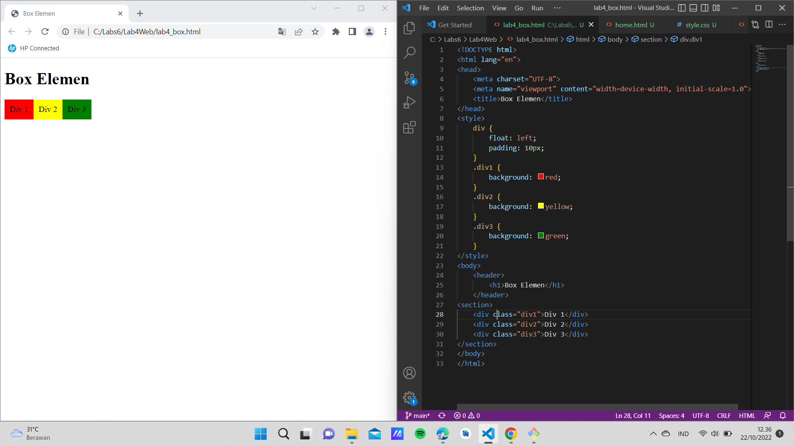
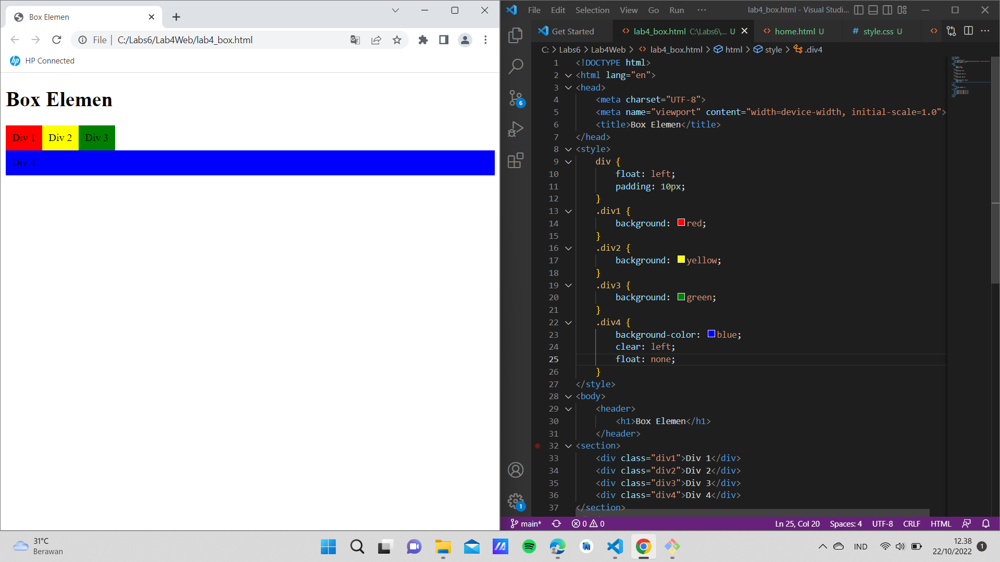
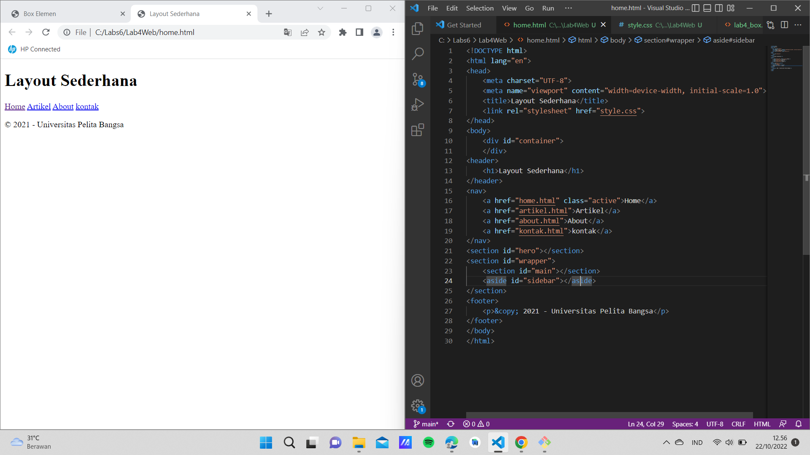
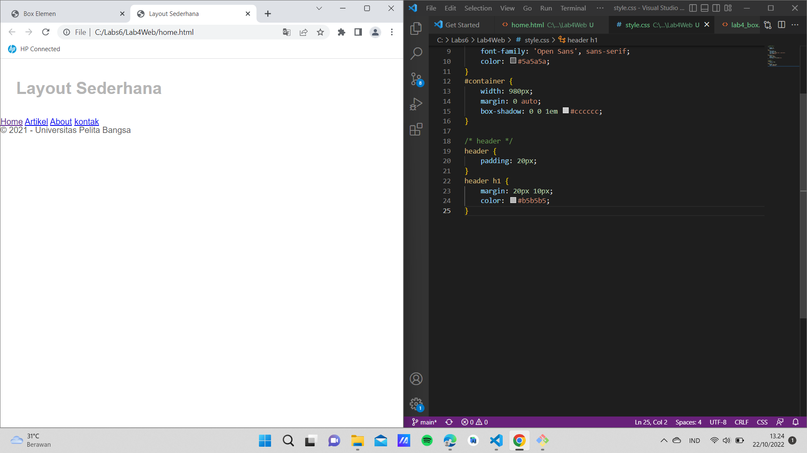
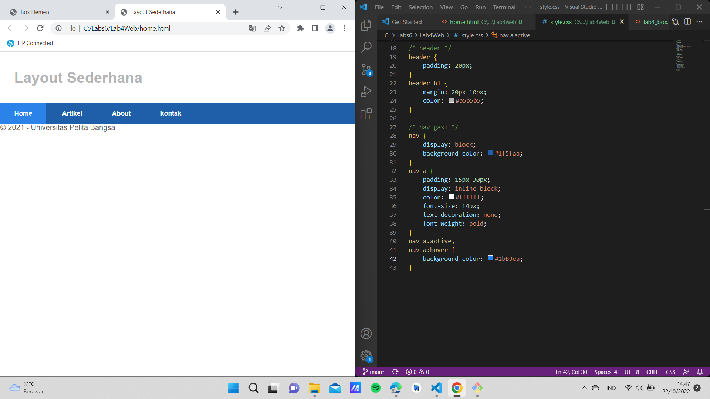
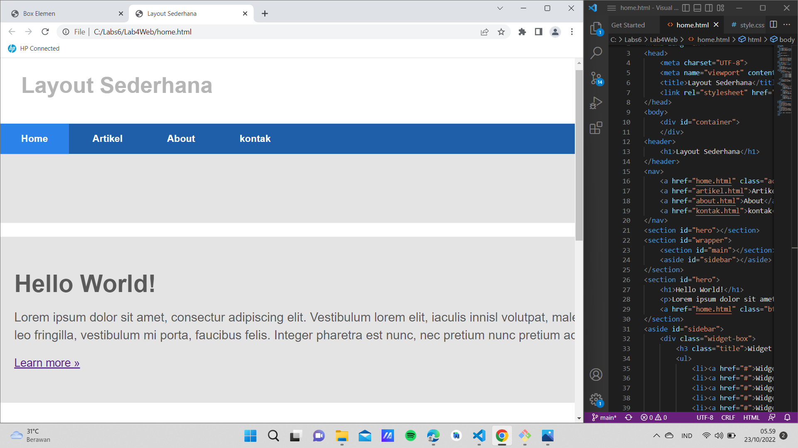
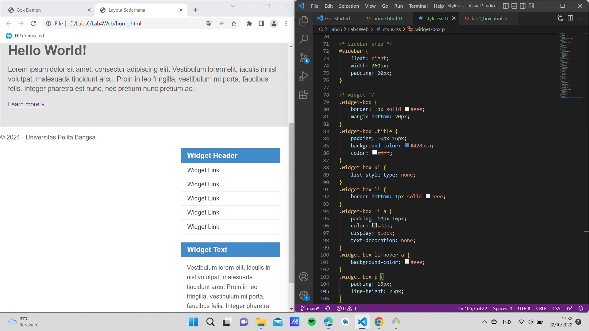
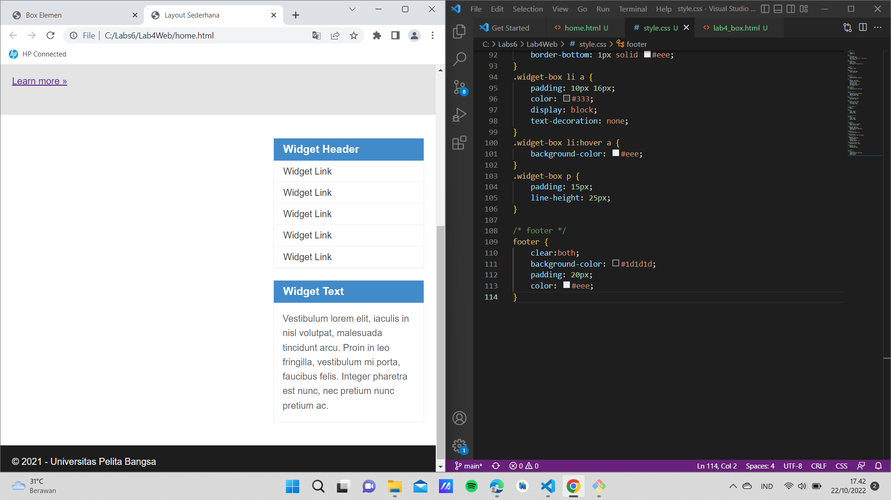
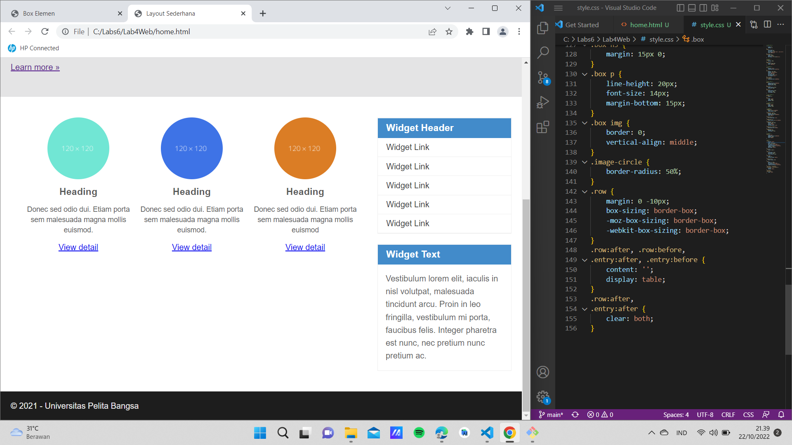
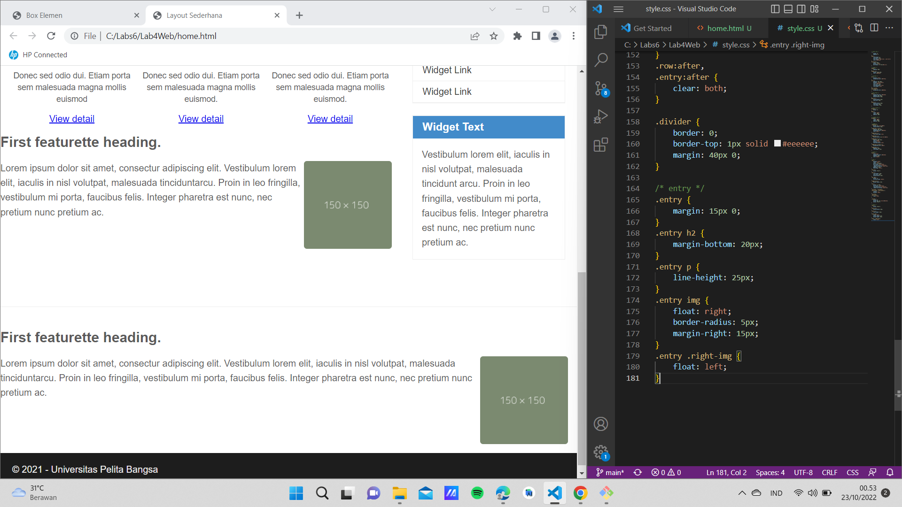

# Lab4Web
# Praktikum 

# Membuat Box Elemen
ini adalah tampilannya

# mengatur clearfix element
ini adalah tampilannya 

# Membuat layout sederhana
ini adalah tampilannya

# Membuat layout sederhana
ini adalah tampilannya

# Membuat navigasi 
ini adalah tampilannya

# Membuat hero panel
ini adalah tampilannya

# Membuat sidebar Widget
ini adalah tampilannya

# Mengatur footer
ini adalah tampilannya 

# Menambahkan elemen pada main content
ini adalah tampilannya

# Menambahkan content artikel
ini adalah tampilannya 
